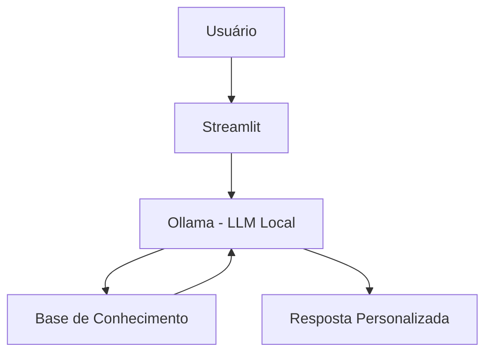

# 🧑‍💼 Fred - Assistente Pessoal Inteligente

> Agente de IA Generativa que gerencia sua agenda, tarefas e lembretes de forma simples e personalizada, usando os próprios dados da sua rotina como exemplos práticos.

## 💡 O Que é o Fred?

O Fred é um assistente pessoal inteligente que **organiza e lembra**, não apenas responde. Ele gerencia compromissos, oferece sugestões baseadas nos seus hábitos e mantém uma base de conhecimento pessoal usando uma abordagem didática e exemplos concretos baseados no seu perfil.

**O que o Fred faz:**
- ✅ Gerencia sua agenda e tarefas do dia
- ✅ Lembra compromissos importantes e aniversários
- ✅ Consulta sua base de conhecimento pessoal (receitas, locais favoritos, regras)
- ✅ Oferece sugestões personalizadas com base nos seus hábitos
- ✅ Mantém contexto de conversas anteriores para interações mais naturais

**O que o Fred NÃO faz:**
- ❌ Não acessa dados bancários ou senhas
- ❌ Não compartilha suas informações com terceiros
- ❌ Não substitui calendários profissionais (mas integra com eles)

## 🏗️ Arquitetura



**Stack:**
- Interface: Streamlit
- LLM: Ollama (modelo local `llama3.2`)
- Dados: JSON/CSV com sua rotina

## 📁 Estrutura do Projeto

├── data/                          # Base de conhecimento pessoal
│   ├── perfil_pessoal.json        # Seus dados: nome, hobbies, objetivos
│   ├── agenda_tarefas.csv         # Compromissos e tarefas
│   ├── historico_conversas.csv    # Interações anteriores
│   └── base_conhecimento.json     # Suas informações de referência
│
├── docs/                          # Documentação completa
│   ├── 01-documentacao-agente.md  # Caso de uso e persona
│   ├── 02-base-conhecimento.md    # Estratégia de dados
│   ├── 03-prompts.md              # System prompt e exemplos
│   ├── 04-metricas.md             # Avaliação de qualidade
│   └── 05-pitch.md                # Apresentação do projeto
│
└── src/
    └── app.py                     # Aplicação Streamlit

## 🚀 Como Executar

### 1. Instalar Ollama

```bash
# Baixar em: ollama.com
ollama pull gpt-oss
ollama serve
```

### 2. Instalar Dependências

```bash
pip install streamlit pandas requests
```

### 3. Configurar os Dados Pessoais

```bash
Edite os arquivos na pasta data/ com suas informações:

perfil_pessoal.json: Seu nome, hobbies, objetivos

agenda_tarefas.csv: Seus compromissos e tarefas

base_conhecimento.json: Receitas, locais favoritos, lembretes
```

### 4. Rodar o Fred
```bash
streamlit run src/app.py
```

## 🎯 Exemplo de Uso

**Pergunta:** "O que tenho hoje?"  
**Edu:** "Bom dia! 🌞 Hoje você tem reunião com cliente às 14:30 e jantar com Ana às 19h. Ah, e não esqueça: hoje é quarta-feira, dia de colocar o lixo orgânico! Quer que eu te lembre 1h antes de cada compromisso?"

**Pergunta:** "Qual restaurante italiano você recomenda?"  
**Edu:** "Baseado no seu gosto, o Terraço Itália é perfeito para ocasiões especiais! Se quiser algo mais casual, tem a Cantina do Piero que você ainda não foi. Quer que eu veja disponibilidade para hoje?"

**Pergunta:** "Como faz o macarrão parisiense?"  
**Edu:** "Vamos cozinhar? 🍝 Ingredientes: macarrão, creme de leite, presunto, ervilha e queijo. É só cozinhar o macarrão, misturar os ingredientes e gratinar no forno. Quer que eu adicione na lista de compras?"

## 📊 Métricas de Avaliação

| Métrica | Objetivo |
|---------|----------|
| **Assertividade** | O assistente lembra o compromisso certo? |
| **Segurança** | 	As sugestões são relevantes para a rotina? |
| **Coerência** | A resposta respeita o contexto e histórico? |
| **Privacidade** | Dados pessoais nunca saem da máquina? |

## 🎬 Diferenciais

- **Personalização:** Usa os dados do próprio usuário nos exemplos
- **100% Local:** Roda com Ollama, sem enviar dados para APIs externas
- **Contexto contínuo:** Lembra de conversas anteriores para interações mais naturais
- **Privacidade:** Seus dados ficam no seu computador, sempre sob seu controle

## 📝 Documentação Completa

Toda a documentação técnica, estratégias de prompt e casos de teste estão disponíveis na pasta [`docs/`](./docs/).
