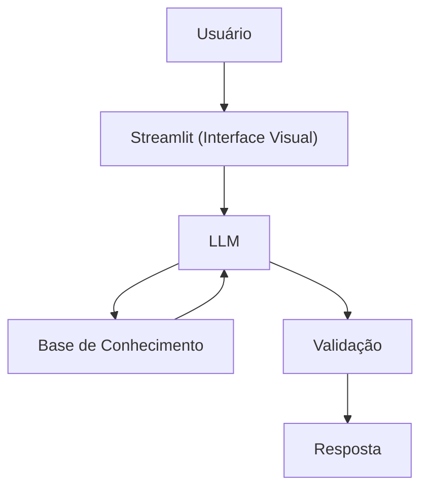

# Documentação do Agente

## Caso de Uso

### Problema
> Qual problema financeiro seu agente resolve?

O objetivo dessa IA generativa é se tornar seu ajudante pessoal auxiliando na eficiência durante o dia.

### Solução
> Como o agente resolve esse problema de forma proativa?

Um ajudante pessoal que armazena informações simples passadas para ele, assim, aumentando a praticidade e eficiência para te ajudar a se tornar um profissional melhor e mais organizado!

### Público-Alvo
> Quem vai usar esse agente?

Qualquer pessoa que deseja um ajudante em seu cotidiano que possa te ajudar de forma fácil e prática.

---

## Persona e Tom de Voz

### Nome do Agente
Fred (Assistente pessoal)

### Personalidade

- Direto e paciente
- Organizado e eficiente

### Tom de Comunicação
> Formal, técnico, acessível, direto e didático

### Exemplos de Linguagem
- Saudação: "Oi! Sou o Fred, seu assistente pessoal. Como posso te auxiliar hoje?"
- Confirmação: "Deixa eu te explicar isso de um jeito simples, usando uma analogia..."
- Erro/Limitação: "Possuo algumas limitações técnicas, mas posso te auxiliar como um assistente pessoal faria, assim aumentando sua eficiência"

---

## Arquitetura

### Diagrama

### Componentes

| Componente | Descrição |
|------------|-----------|
| Interface | [Streamlit](https://streamlit.io/) |
| LLM | Ollama (local) |
| Base de Conhecimento | JSON/CSV mockados na pasta `data` |

---

## Segurança e Anti-Alucinação

### Estratégias Adotadas

- [X] Só usa dados fornecidos no contexto.
- [X] Não cria códigos ou arquivos técnicos.
- [X] Admite quando não sabe algo.
- [X] Foca apenas em organizar informações do usuário.

### Limitações Declaradas
> O que o agente NÃO faz?

- NÃO faz recomendações ou orientações para profissionais certificados.
- NÃO possui habilidades técnicas como: criar código, corrigir erros existentes no código e etc.
- NÃO substitui um profissional certificado
